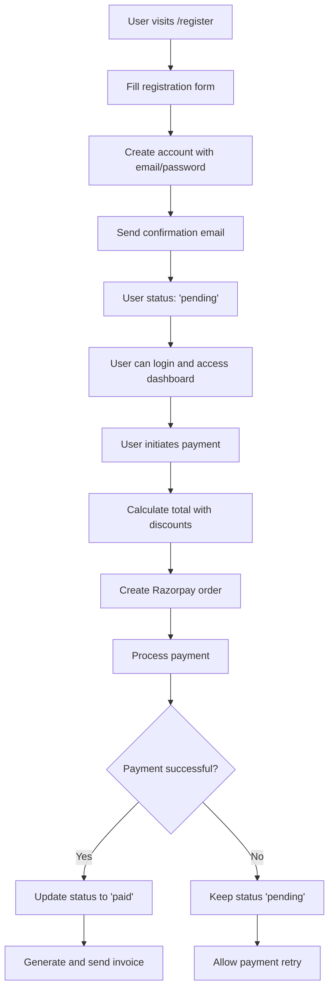

# NeuroTrauma 2026 Conference Platform - Design Document

## Overview

The NeuroTrauma 2026 Conference Platform is designed as a full-stack Next.js application with MongoDB Atlas backend, focusing on user registration, authentication, payment processing, and admin management. The system prioritizes the urgent delivery of core functionality: website completion, user login system, and payment integration.

## Architecture

### System Architecture
```
┌─────────────────┐    ┌─────────────────┐    ┌─────────────────┐
│   Frontend      │    │   Backend API   │    │   Database      │
│   (Next.js)     │◄──►│   (Next.js API) │◄──►│  (MongoDB)      │
│                 │    │                 │    │                 │
│ - Public Pages  │    │ - Auth Routes   │    │ - Users         │
│ - User Dashboard│    │ - Payment API   │    │ - Registrations │
│ - Admin Panel   │    │ - Admin API     │    │ - Payments      │
└─────────────────┘    └─────────────────┘    └─────────────────┘
         │                       │                       │
         │              ┌─────────────────┐              │
         │              │   External      │              │
         └──────────────┤   Services      ├──────────────┘
                        │                 │
                        │ - Razorpay      │
                        │ - Email Service │
                        │ - File Storage  │
                        └─────────────────┘
```

### Technology Stack
- **Frontend:** Next.js 14 with App Router, TypeScript, Tailwind CSS, Server-Side Rendering (SSR)
- **Backend:** Next.js API Routes, MongoDB with Mongoose
- **Authentication:** NextAuth.js with credentials provider
- **Payment:** Razorpay integration
- **Email:** Resend or Nodemailer
- **Deployment:** VPS with PM2 and Nginx
- **Rendering Strategy:** SSR for public pages, CSR for authenticated dashboards

## Components and Interfaces

### 1. Database Schema (MongoDB Collections)

#### Users Collection
```javascript
{
  _id: ObjectId,
  email: String (unique, required),
  password: String (hashed, required),
  profile: {
    title: String, // Dr., Prof., Mr., Mrs., Ms.
    firstName: String (required),
    lastName: String (required),
    phone: String (required),
    institution: String (required),
    address: {
      street: String,
      city: String,
      state: String,
      country: String,
      pincode: String
    },
    profilePicture: String, // file path
    dietaryRequirements: String,
    specialNeeds: String
  },
  registration: {
    registrationId: String (unique),
    type: String, // 'regular', 'student', 'international', 'faculty'
    status: String, // 'pending', 'paid', 'cancelled'
    membershipNumber: String,
    workshopSelections: [String],
    accompanyingPersons: [{
      name: String,
      age: Number,
      dietaryRequirements: String,
      relationship: String
    }],
    registrationDate: Date,
    paymentDate: Date
  },
  role: String, // 'user', 'admin', 'reviewer'
  isActive: Boolean,
  createdAt: Date,
  updatedAt: Date
}
```

#### Payments Collection
```javascript
{
  _id: ObjectId,
  userId: ObjectId (ref: Users),
  registrationId: String,
  razorpayOrderId: String,
  razorpayPaymentId: String,
  razorpaySignature: String,
  amount: {
    registration: Number,
    workshops: Number,
    accompanyingPersons: Number,
    discount: Number,
    total: Number,
    currency: String
  },
  breakdown: {
    registrationType: String,
    baseAmount: Number,
    workshopFees: [{
      name: String,
      amount: Number
    }],
    accompanyingPersonFees: Number,
    discountsApplied: [{
      type: String, // 'independence', 'early-bird', 'code'
      code: String,
      percentage: Number,
      amount: Number
    }]
  },
  status: String, // 'pending', 'completed', 'failed', 'refunded'
  paymentMethod: String,
  transactionDate: Date,
  invoiceGenerated: Boolean,
  invoicePath: String,
  createdAt: Date
}
```

#### Configuration Collection (Admin-managed)
```javascript
{
  _id: ObjectId,
  type: String, // 'pricing', 'discounts', 'content', 'settings'
  key: String,
  value: Mixed, // Flexible schema for different config types
  isActive: Boolean,
  createdBy: ObjectId (ref: Users),
  createdAt: Date,
  updatedAt: Date
}

// Example configurations:
// Pricing Config
{
  type: 'pricing',
  key: 'registration_categories',
  value: {
    regular: { amount: 15000, currency: 'INR', label: 'Regular Delegate' },
    student: { amount: 8000, currency: 'INR', label: 'Student/Resident' },
    international: { amount: 300, currency: 'USD', label: 'International Delegate' },
    faculty: { amount: 12000, currency: 'INR', label: 'Faculty Member' },
    accompanying: { amount: 3000, currency: 'INR', label: 'Accompanying Person' }
  }
}

// Workshop Config
{
  type: 'pricing',
  key: 'workshops',
  value: [
    { id: 'joint-replacement', name: 'Advanced Joint Replacement', amount: 2000 },
    { id: 'arthroscopic', name: 'Arthroscopic Surgery Masterclass', amount: 2500 },
    { id: 'spine-surgery', name: 'Spine Surgery Innovations', amount: 2000 },
    { id: 'trauma-management', name: 'Trauma Management', amount: 1500 }
  ]
}

// Discount Config
{
  type: 'discounts',
  key: 'active_discounts',
  value: [
    {
      id: 'independence-day',
      name: 'Independence Day Special',
      type: 'time-based',
      percentage: 15,
      startDate: '2024-08-10',
      endDate: '2024-08-20',
      applicableCategories: ['regular', 'faculty']
    },
    {
      id: 'early-bird',
      name: 'Early Bird Discount',
      type: 'time-based',
      percentage: 10,
      endDate: '2024-07-31',
      applicableCategories: ['all']
    }
  ]
}
```

### 2. API Routes Structure

#### Authentication APIs
```
POST /api/auth/register
POST /api/auth/login
POST /api/auth/logout
POST /api/auth/forgot-password
POST /api/auth/reset-password
GET  /api/auth/verify-email
```

#### User APIs
```
GET    /api/user/profile
PUT    /api/user/profile
GET    /api/user/registration
PUT    /api/user/registration
POST   /api/user/upload-avatar
```

#### Payment APIs
```
POST   /api/payment/create-order
POST   /api/payment/verify-payment
GET    /api/payment/invoice/:id
POST   /api/payment/apply-discount
GET    /api/payment/pricing
```

#### Admin APIs
```
GET    /api/admin/dashboard
GET    /api/admin/registrations
GET    /api/admin/payments
POST   /api/admin/bulk-email
GET    /api/admin/export/:type
PUT    /api/admin/config/:type
GET    /api/admin/config/:type
```

### 3. Frontend Component Architecture

#### Page Structure
```
app/
├── (auth)/
│   ├── login/page.tsx
│   ├── register/page.tsx
│   └── forgot-password/page.tsx
├── dashboard/
│   ├── page.tsx (User Dashboard)
│   ├── profile/page.tsx
│   ├── payment/page.tsx
│   └── registration/page.tsx
├── admin/
│   ├── page.tsx (Admin Dashboard)
│   ├── registrations/page.tsx
│   ├── payments/page.tsx
│   ├── config/page.tsx
│   └── emails/page.tsx
├── api/ (API Routes)
└── (public pages - existing)
```

#### Key Components
```
components/
├── auth/
│   ├── LoginForm.tsx
│   ├── RegisterForm.tsx
│   └── ProtectedRoute.tsx
├── dashboard/
│   ├── UserDashboard.tsx
│   ├── RegistrationCard.tsx
│   └── PaymentStatus.tsx
├── payment/
│   ├── PaymentForm.tsx
│   ├── PricingCalculator.tsx
│   └── InvoiceViewer.tsx
├── admin/
│   ├── AdminDashboard.tsx
│   ├── RegistrationTable.tsx
│   ├── PaymentTable.tsx
│   ├── ConfigManager.tsx
│   └── BulkEmailForm.tsx
└── ui/ (existing shadcn components)
```

## Data Models

### User Registration Flow


### Payment Calculation Logic
```javascript
// Payment calculation algorithm
function calculatePayment(registrationType, workshops, accompanyingPersons, discountCodes) {
  const pricing = await getPricingConfig();
  const discounts = await getActiveDiscounts();
  
  let total = 0;
  
  // Base registration fee
  total += pricing.registration_categories[registrationType].amount;
  
  // Workshop fees
  workshops.forEach(workshop => {
    total += pricing.workshops.find(w => w.id === workshop).amount;
  });
  
  // Accompanying person fees
  total += accompanyingPersons.length * pricing.registration_categories.accompanying.amount;
  
  // Apply discounts
  let discountAmount = 0;
  discounts.forEach(discount => {
    if (isDiscountApplicable(discount, registrationType)) {
      discountAmount += (total * discount.percentage / 100);
    }
  });
  
  return {
    subtotal: total,
    discount: discountAmount,
    total: total - discountAmount,
    breakdown: { /* detailed breakdown */ }
  };
}
```

## Error Handling

### Error Boundary Implementation
```typescript
// Global error boundary for the application
class AppErrorBoundary extends Component {
  constructor(props) {
    super(props);
    this.state = { hasError: false, error: null };
  }

  static getDerivedStateFromError(error) {
    return { hasError: true, error };
  }

  componentDidCatch(error, errorInfo) {
    // Log error to monitoring service
    console.error('Application Error:', error, errorInfo);
  }

  render() {
    if (this.state.hasError) {
      return <ErrorFallback error={this.state.error} />;
    }
    return this.props.children;
  }
}
```

### API Error Handling
```typescript
// Standardized API error responses
interface APIError {
  success: false;
  error: {
    code: string;
    message: string;
    details?: any;
  };
  timestamp: string;
}

// Error handling middleware
export function withErrorHandling(handler) {
  return async (req, res) => {
    try {
      return await handler(req, res);
    } catch (error) {
      console.error('API Error:', error);
      
      if (error.name === 'ValidationError') {
        return res.status(400).json({
          success: false,
          error: {
            code: 'VALIDATION_ERROR',
            message: 'Invalid input data',
            details: error.errors
          },
          timestamp: new Date().toISOString()
        });
      }
      
      return res.status(500).json({
        success: false,
        error: {
          code: 'INTERNAL_ERROR',
          message: 'An unexpected error occurred'
        },
        timestamp: new Date().toISOString()
      });
    }
  };
}
```

## Testing Strategy

### Unit Testing
- **Components:** React Testing Library for UI components
- **API Routes:** Jest for API endpoint testing
- **Utilities:** Jest for helper functions and calculations

### Integration Testing
- **Payment Flow:** End-to-end payment process testing
- **Authentication:** Login/logout flow testing
- **Database Operations:** MongoDB integration testing

### Performance Testing
- **Load Testing:** Payment gateway under load
- **Bundle Analysis:** Webpack bundle analyzer
- **Lighthouse:** Core Web Vitals monitoring

## Security Considerations

### Authentication Security
- Password hashing with bcrypt (minimum 12 rounds)
- JWT tokens with short expiration (15 minutes access, 7 days refresh)
- Rate limiting on authentication endpoints
- Account lockout after failed attempts

### Payment Security
- PCI DSS compliance through Razorpay
- No storage of sensitive payment data
- Webhook signature verification
- HTTPS enforcement

### Data Protection
- Input validation and sanitization
- SQL injection prevention (NoSQL injection for MongoDB)
- XSS protection with Content Security Policy
- CSRF protection with tokens

This design provides a solid foundation for the urgent tasks: completing the website, implementing user login, and integrating payment processing. The architecture is scalable and can accommodate future features like abstract submission and reviewer portals.
##
 Server-Side Rendering Strategy

### SSR Implementation for Performance

#### Public Pages (SSR)
```typescript
// app/page.tsx - Homepage with SSR
export default async function HomePage() {
  // Fetch conference data server-side
  const conferenceData = await getConferenceConfig();
  const pricingData = await getPricingConfig();
  
  return (
    <div>
      <HeroSection data={conferenceData} />
      <PricingSection pricing={pricingData} />
      {/* Pre-rendered content for faster loading */}
    </div>
  );
}

// Pre-fetch data at build time for static content
export async function generateStaticParams() {
  return {
    revalidate: 3600 // Revalidate every hour
  };
}
```

#### Dynamic Content with ISR
```typescript
// app/register/page.tsx - Registration with ISR
export default async function RegisterPage() {
  // Server-side data fetching for pricing and discounts
  const pricingConfig = await getPricingConfig();
  const activeDiscounts = await getActiveDiscounts();
  
  return (
    <RegistrationForm 
      pricing={pricingConfig}
      discounts={activeDiscounts}
    />
  );
}

// Incremental Static Regeneration for admin-updated content
export const revalidate = 300; // 5 minutes
```

#### Performance Optimizations

##### 3D Model Loading with SSR
```typescript
// components/3d/BrainModel.tsx - Optimized 3D loading
import dynamic from 'next/dynamic';
import { Suspense } from 'react';

// Lazy load 3D components to prevent SSR issues
const BrainModelClient = dynamic(() => import('./BrainModelClient'), {
  ssr: false, // Disable SSR for 3D components
  loading: () => <ModelSkeleton />
});

export default function BrainModel() {
  return (
    <Suspense fallback={<ModelSkeleton />}>
      <BrainModelClient />
    </Suspense>
  );
}
```

##### Image Optimization
```typescript
// components/ui/OptimizedImage.tsx
import Image from 'next/image';

export function OptimizedImage({ src, alt, ...props }) {
  return (
    <Image
      src={src}
      alt={alt}
      priority={props.priority || false}
      placeholder="blur"
      blurDataURL="data:image/jpeg;base64,/9j/4AAQSkZJRgABAQAAAQ..."
      sizes="(max-width: 768px) 100vw, (max-width: 1200px) 50vw, 33vw"
      {...props}
    />
  );
}
```

### Caching Strategy

#### Redis Integration (Optional Phase 2)
```typescript
// lib/cache.ts - Caching layer
import Redis from 'ioredis';

const redis = new Redis(process.env.REDIS_URL);

export async function getCachedData(key: string, fetcher: () => Promise<any>, ttl = 3600) {
  try {
    const cached = await redis.get(key);
    if (cached) {
      return JSON.parse(cached);
    }
    
    const data = await fetcher();
    await redis.setex(key, ttl, JSON.stringify(data));
    return data;
  } catch (error) {
    // Fallback to direct fetch if Redis fails
    return await fetcher();
  }
}

// Usage in API routes
export async function GET() {
  const pricingData = await getCachedData(
    'pricing-config',
    () => getPricingFromDB(),
    1800 // 30 minutes cache
  );
  
  return Response.json(pricingData);
}
```

#### Database Query Optimization
```typescript
// lib/db/queries.ts - Optimized MongoDB queries
export async function getConferenceDataOptimized() {
  return await Promise.all([
    // Parallel queries for better performance
    Configuration.find({ type: 'content', isActive: true }).lean(),
    Configuration.find({ type: 'pricing', isActive: true }).lean(),
    Configuration.find({ type: 'discounts', isActive: true }).lean()
  ]);
}

// Indexed queries for better performance
export async function getUserRegistrations(userId: string) {
  return await User.findById(userId)
    .populate('payments')
    .select('-password') // Exclude sensitive data
    .lean(); // Return plain objects for better performance
}
```

### Bundle Optimization for SSR

#### Code Splitting Strategy
```typescript
// next.config.mjs - Enhanced configuration
const nextConfig = {
  // ... existing config
  
  // Optimize for SSR performance
  experimental: {
    optimizePackageImports: [
      'lucide-react',
      '@radix-ui/react-icons',
      'framer-motion',
      '@react-three/fiber',
      '@react-three/drei'
    ],
    serverComponentsExternalPackages: ['mongoose', 'bcryptjs']
  },
  
  // Image optimization
  images: {
    domains: ['localhost', 'your-domain.com'],
    formats: ['image/webp', 'image/avif'],
    minimumCacheTTL: 60,
  },
  
  // Compression
  compress: true,
  
  // Bundle analyzer in development
  webpack: (config, { dev, isServer }) => {
    if (dev && !isServer) {
      const { BundleAnalyzerPlugin } = require('webpack-bundle-analyzer');
      config.plugins.push(
        new BundleAnalyzerPlugin({
          analyzerMode: 'server',
          openAnalyzer: false,
        })
      );
    }
    return config;
  }
};
```

#### Component-Level Optimizations
```typescript
// components/ui/LazyComponents.tsx - Lazy loading for heavy components
import { lazy, Suspense } from 'react';

// Lazy load heavy components
const AdminDashboard = lazy(() => import('./AdminDashboard'));
const PaymentForm = lazy(() => import('./PaymentForm'));
const RegistrationTable = lazy(() => import('./RegistrationTable'));

export function LazyAdminDashboard() {
  return (
    <Suspense fallback={<DashboardSkeleton />}>
      <AdminDashboard />
    </Suspense>
  );
}
```

### Performance Monitoring

#### Core Web Vitals Tracking
```typescript
// app/layout.tsx - Performance monitoring
import { Analytics } from '@vercel/analytics/react';

export default function RootLayout({ children }) {
  return (
    <html>
      <body>
        {children}
        <Analytics />
        <WebVitalsReporter />
      </body>
    </html>
  );
}

// components/WebVitalsReporter.tsx
'use client';
import { useReportWebVitals } from 'next/web-vitals';

export function WebVitalsReporter() {
  useReportWebVitals((metric) => {
    // Send to analytics service
    console.log(metric);
  });
  
  return null;
}
```

This SSR strategy will significantly improve loading times, especially for the conference website's public pages, while maintaining interactivity for authenticated user areas.